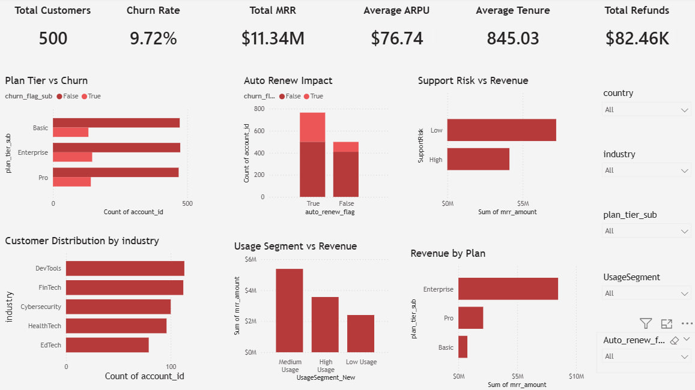

# SaaS Customer Retention & Subscription Analytics

## Project Overview
This project analyzes SaaS customer retention, subscription behavior, churn patterns, customer engagement, and revenue performance using Python and Power BI.

The objective was to transform raw multi-table SaaS business data into actionable retention insights, churn intelligence, customer segmentation, and executive-level business dashboards.

---

## Business Problem
SaaS companies rely heavily on customer retention, recurring revenue, and product engagement for sustainable growth.

This project answers key business questions such as:

- Which subscription plans experience higher churn?
- Does auto-renew reduce customer churn?
- How does product usage influence revenue?
- Do support interactions indicate retention risk?
- Which industries contribute the most customers?
- What is the current subscription revenue performance?
- How do refunds impact business revenue?

---

## Tech Stack
- Python
- Pandas
- NumPy
- Matplotlib
- Seaborn
- Power BI

---

## Dataset
RavenStack SaaS Subscription & Churn Analytics Dataset

Dataset includes multiple business tables:

- customer accounts
- subscription records
- product feature usage
- support tickets
- churn event history

Business entities analyzed:

- customer subscriptions
- monthly recurring revenue (MRR)
- annual recurring revenue (ARR)
- churn indicators
- support escalations
- usage metrics
- customer satisfaction
- refund behavior
- auto-renew subscriptions

---

## Data Engineering & Processing
Performed end-to-end data preparation including:

- loading multiple SaaS datasets
- datetime conversion
- business table merging
- usage aggregation
- support ticket aggregation
- churn event integration
- missing value handling
- feature engineering
- export for dashboard analytics

Merged datasets included:

- accounts
- subscriptions
- feature usage
- support tickets
- churn events

Feature engineering included:

- customer tenure calculation
- ARPU calculation
- support risk segmentation
- usage segmentation
- revenue metric preparation

---

## Key KPIs
- **Total Customers:** 500
- **Churn Rate:** 9.72%
- **Total MRR:** $11.34 Million
- **Average ARPU:** $76.74
- **Average Customer Tenure:** 845 Days
- **Total Refunds:** $82.46K

---

## Exploratory Data Analysis
Business analysis performed:

- churn by subscription plan
- auto-renew churn impact
- revenue by subscription plan
- support interaction impact
- product usage vs revenue analysis
- customer distribution by industry
- country-level customer analysis
- churn behavior exploration
- feature correlation analysis

---

## Dashboard Features
Interactive Power BI dashboard includes:

- executive KPI summary cards
- churn by subscription plan
- auto-renew retention analysis
- support risk vs revenue analysis
- usage segment revenue analysis
- industry customer segmentation
- subscription revenue analysis
- interactive slicer-based filtering

Filters included:

- country
- industry
- subscription plan
- usage segment
- auto-renew status

---

## Key Business Insights

### Auto-Renew Supports Retention
Customers with auto-renew subscriptions showed significantly stronger retention behavior.

### Enterprise Plans Drive Revenue
Enterprise subscriptions generated the highest recurring revenue contribution.

### Product Usage Influences Revenue
Higher product engagement correlated with stronger revenue performance.

### Support Activity Indicates Risk
Customers with higher support interaction showed potential retention risk signals.

### Industry Concentration
Specific industries contributed a major portion of the customer base, highlighting market concentration opportunities.

### Refund Impact
Refund events directly contributed to measurable revenue leakage.

---

## Business Recommendations
Based on analysis:

- improve auto-renew adoption campaigns
- strengthen onboarding for low-engagement customers
- proactively monitor high-support-risk customers
- focus upsell efforts on high-value subscription segments
- reduce refund leakage through customer success interventions
- build industry-targeted growth campaigns
- improve retention monitoring dashboards

---

## Dashboard Preview


---

## Project Structure

```bash
SaaS_Customer_Retention_Subscription_Analytics/
│
├── SaaS_Customer_Retention_Subscription_Analytics.ipynb
├── SaaS_Customer_Retention_Subscription_Analytics.pbix
├── saas_retention_cleaned.csv
├── SaaS_Customer_Retention_Subscription_Analytics.jpg
└── README.md
```

---

## Future Improvements
- predictive churn modeling
- customer lifetime value analytics
- cohort retention analysis
- anomaly detection for churn spikes
- cloud deployment dashboard
- real-time subscription monitoring

---

## Author
**Jayanth**
